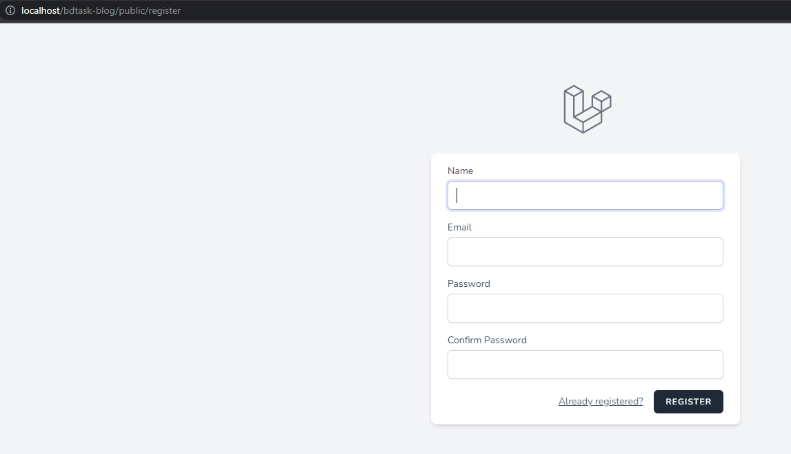
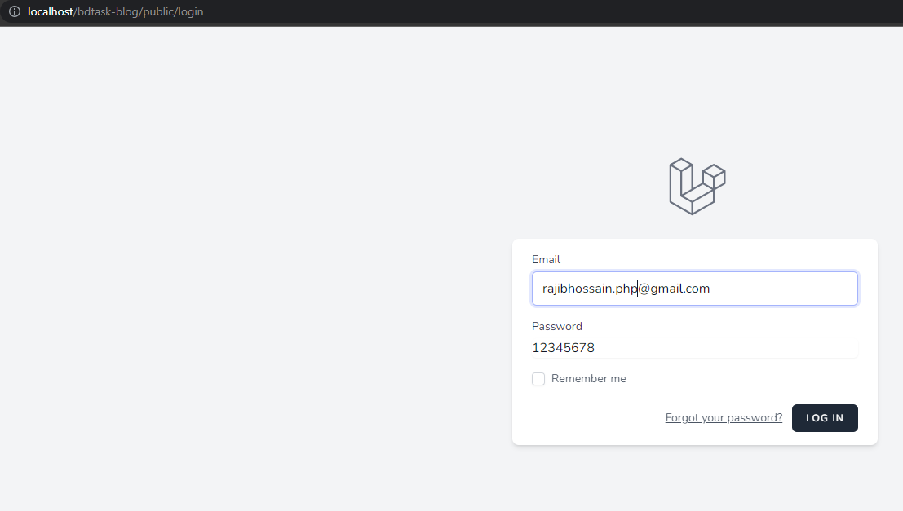
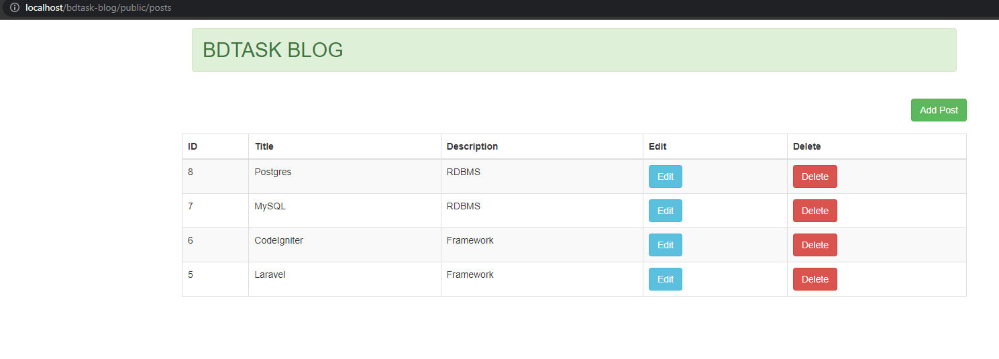
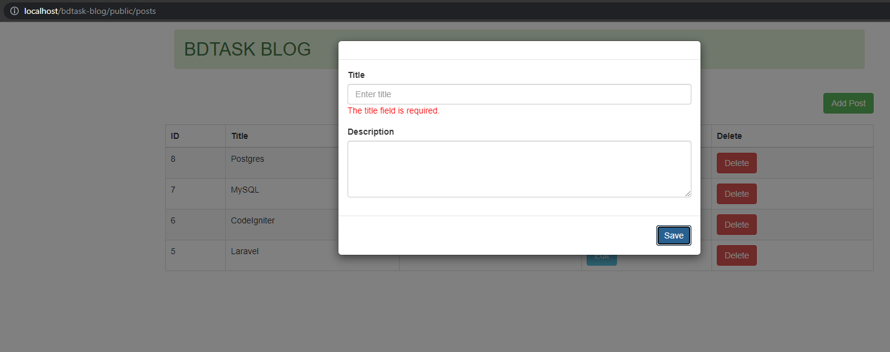
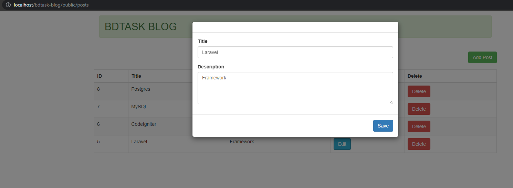

# BDTASK-BLOG

## Installation
Just clone the project from GIT and place and run to your web like "localhost/bdtask-blog/public". PHP =>73 version needed.   
Run composer install  
Run npm install  
Run php artisan migrate  
Hit localhost/bdtask-blog/public/register URL  
Login with the registered useremail + password from localhost/bdtask-blog/public/login URL  
Add/Update/Delete posts from the Admin Panel  

## Screenshots

